```mermaid
sequenceDiagram
    autonumber

    participant User  as User (Browser)
    participant FE    as Frontend (Next.js)
    participant BE    as Backend (Fastify)
    participant DB    as Database
    participant bKash as bKash RPP Gateway

    %% ─── SUBSCRIPTION CREATION ────────────────────────────────────────────
    Note over User,bKash: STEP 1 — SUBSCRIPTION CREATION

    User->>FE: Fill recurring subscription form<br/>(amount, frequency, customerName, phone)
    FE->>BE: POST /api/v1/public/recurring-bkash<br/>{customerName, amount, frequency, planId}
    BE->>DB: Find or create Customer
    BE->>DB: Create RecurringSubscription (status=initiated)
    BE->>DB: Create Order (status=pending)
    Note right of BE: Generate subscriptionRequestId<br/>e.g. SUB-REQ-1773607107574-8VGIH<br/>Embed in callbackUrl path
    BE->>bKash: POST /api/subscription<br/>{subscriptionRequestId, serviceId,<br/>frequency, amount, redirectUrl}
    bKash-->>BE: {redirectURL, expirationTime}
    BE->>DB: Update RecurringSubscription<br/>(status=processing, subscriptionRequestId)
    BE->>DB: Create PaymentTransaction (audit)
    BE-->>FE: 201 {paymentUrl, recurringOrderId}
    FE-->>User: Redirect to bKash consent page (redirectURL)

    %% ─── USER CONSENT ──────────────────────────────────────────────────────
    Note over User,bKash: STEP 2 — USER CONSENT ON bKASH PAGE

    User->>bKash: Enter bKash wallet number
    User->>bKash: Enter OTP
    User->>bKash: Enter PIN and confirm

    %% ─── CALLBACK ──────────────────────────────────────────────────────────
    Note over User,BE: STEP 3 — CALLBACK (bKash redirects user back)

    bKash-->>User: Redirect to<br/>/callback/{subscriptionRequestId}?reference=XXX&status=SUCCEEDED|CANCELLED|FAILED

    User->>BE: GET /callback/{subscriptionRequestId}?reference=XXX&status=...
    BE->>DB: Find RecurringSubscription by subscriptionRequestId

    alt bKash redirect status = CANCELLED
        BE->>DB: Update status=aborted
        BE-->>User: Redirect → /payment/cancel?rid=...
    else bKash redirect status = FAILED
        BE->>DB: Update status=aborted
        BE-->>User: Redirect → /payment/fail?error=subscription_failed
    else bKash redirect status = SUCCEEDED
        BE->>bKash: GET /api/subscriptions/request-id/{subscriptionRequestId}
        bKash-->>BE: {id, status, payer, amount, frequency, nextPaymentDate}
        BE->>DB: Update RecurringSubscription<br/>(subscriptionId=bKash numeric ID, acctNo=payer, status)
        BE-->>User: Redirect → /payment/success?amount=...&rid=...&invoice=...
    end

    %% ─── PAYMENT WEBHOOK ───────────────────────────────────────────────────
    Note over BE,bKash: STEP 4 — PAYMENT WEBHOOK (auto-debit each cycle)

    bKash->>BE: POST /webhook<br/>Header: Type=PAYMENT<br/>{paymentId, trxId, amount,<br/>paymentStatus, nextPaymentDate, payer}
    BE->>BE: Verify HMAC-SHA256 signature<br/>(base64-decoded API key)
    BE->>DB: Find RecurringSubscription<br/>(by subscriptionId or subscriptionRequestId)

    alt paymentStatus = SUCCEEDED_PAYMENT
        BE->>DB: Update pending Order → completed<br/>or create new Order (subsequent cycle)
        BE->>DB: Update PaymentTransaction (status=success, trxId)
        BE->>DB: Update RecurringSubscription<br/>(totalCharged+, successCount+, nextBillingDate, status=active)
        BE->>DB: Update Customer (totalSpent+, orderCount+)
        BE->>User: Send email notification
        BE-->>bKash: 200 OK
    else paymentStatus = FAILED_PAYMENT
        BE->>DB: Create Order (status=failed)
        BE->>DB: Update RecurringSubscription (failedCount+)
        BE-->>bKash: 200 OK
    end

    %% ─── SUBSCRIPTION STATUS WEBHOOK ───────────────────────────────────────
    Note over BE,bKash: STEP 5 — SUBSCRIPTION STATUS WEBHOOK (optional)

    bKash->>BE: POST /webhook<br/>Header: Type=SUBSCRIPTION<br/>{subscriptionId, subscriptionStatus, nextPaymentDate}
    BE->>BE: Verify signature
    BE->>DB: Update RecurringSubscription status<br/>VERIFIED→processing | SUCCEEDED→active | CANCELLED→cancelled
    BE-->>bKash: 200 OK

    %% ─── PRE-NOTIFICATION WEBHOOK ──────────────────────────────────────────
    Note over BE,bKash: STEP 6 — PRE-NOTIFICATION WEBHOOK (payment reminder)

    bKash->>BE: POST /webhook<br/>Header: Type=PRE_NOTIFICATION<br/>{subscriptionId, nextPaymentDate, amount}
    BE->>BE: Verify signature
    BE-->>bKash: 200 OK (acknowledged, no DB change)

    %% ─── CANCELLATION ───────────────────────────────────────────────────────
    Note over BE,bKash: STEP 7 — CANCELLATION (admin or public)

    User->>BE: POST /api/v1/recurring-subscriptions/{id}/cancel<br/>(admin) or<br/>POST /public/recurring-bkash/{subscriptionId}/cancel
    BE->>bKash: DELETE /api/subscriptions/{bkashSubscriptionId}?reason=...
    bKash-->>BE: {subscriptionId, subscriptionStatus=CANCELLED}
    BE->>DB: Update RecurringSubscription (status=cancelled, cancelledAt)
    BE-->>User: 200 OK

    bKash->>BE: POST /webhook Type=CANCEL<br/>{subscriptionId, cancelledBy}
    BE->>BE: Verify signature
    BE->>DB: Update RecurringSubscription (status=cancelled)
    BE->>DB: Cancel any pending Orders
    BE-->>bKash: 200 OK

    %% ─── REFUND ─────────────────────────────────────────────────────────────
    Note over BE,bKash: STEP 8 — REFUND (admin)

    User->>BE: POST /api/v1/recurring-subscriptions/{id}/bkash-refund<br/>{paymentId, amount}
    BE->>bKash: POST /api/subscription/payment/refund<br/>{paymentId, amount}
    bKash-->>BE: 200 OK (immediate — result comes via webhook)
    BE-->>User: {submitted: true}

    bKash->>BE: POST /webhook Type=REFUND<br/>{reverseTrxId, refundedAmount, paymentStatus}
    BE->>BE: Verify signature
    alt paymentStatus = SUCCEEDED_REFUND
        BE->>DB: Update Order (status=refunded)
        BE->>DB: Reverse Customer totalSpent
        BE->>DB: Reduce RecurringSubscription totalCharged
    end
    BE-->>bKash: 200 OK

    %% ─── EXPIRY ─────────────────────────────────────────────────────────────
    Note over BE,bKash: STEP 9 — EXPIRY (subscription end date reached)

    bKash->>BE: POST /webhook Type=EXPIRY<br/>{subscriptionId, subscriptionStatus=EXPIRED}
    BE->>BE: Verify signature
    BE->>DB: Update RecurringSubscription (status=deactivated, deactivatedAt, endDate=now)
    BE-->>bKash: 200 OK
```

# bKash Recurring Payment — Flow Diagram

Paste the code block below at **https://mermaid.live** (or any Mermaid renderer).

---

---

## Key Data Points to Note During Testing

| What to capture | Where to find it |
|---|---|
| `subscriptionRequestId` (e.g. `SUB-REQ-xxx`) | Server log after Step 1 create |
| bKash `redirectURL` | Server log Create Subscription API response |
| bKash numeric `subscriptionId` | Server log after Step 3 callback query |
| `payer` (customer wallet number) | Server log after Step 3 callback query |
| `paymentId` (bKash payment ID) | Server log PAYMENT webhook body |
| `trxId` (transaction ID) | Server log PAYMENT webhook body |
| `reverseTrxId` (refund TxID) | Server log REFUND webhook body |
| Browser URL on success page | Screenshot — includes `rid=` Recurring ID |
| Browser URL on fail page | Screenshot — includes `error=`, `invoice=` |
| Browser URL on cancel page | Screenshot — includes `rid=` |
